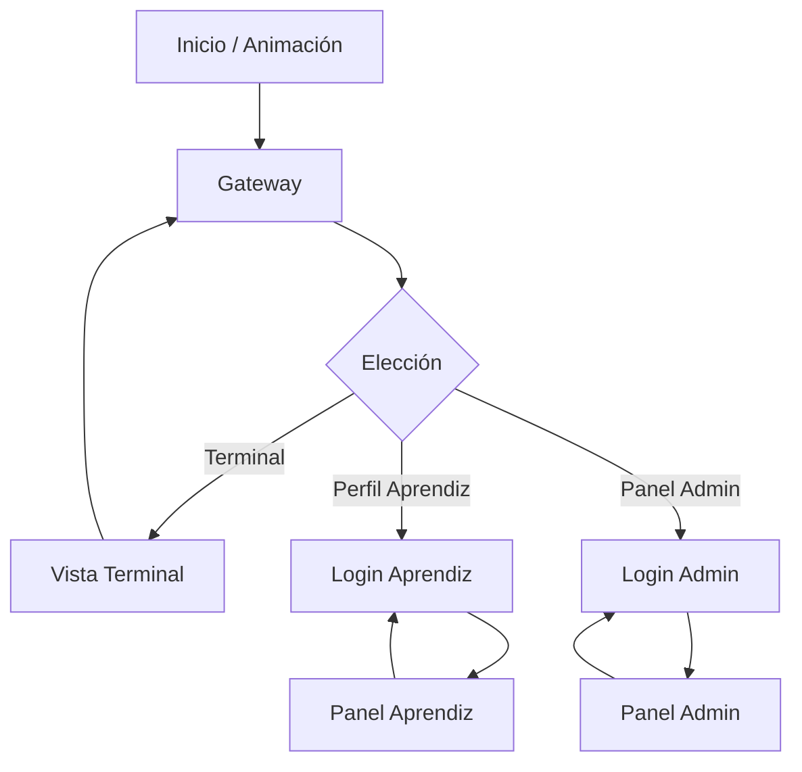

 # 📘 GUÍA COMPLETA DE PRESENTACIÓN - CHRONOS REGISTRY SYSTEM (C.R.S)

## 🎯 Visión General del Proyecto

**C.R.S** es un sistema de registro de asistencia para el SENA que permite:
- ✅ Marcación de entrada/salida (Terminal)
- 👤 Consulta de asistencia por parte de aprendices
- 👨‍💼 Gestión administrativa de estudiantes
- 📊 Historial y reportes de asistencia

**Tecnología:**
- Frontend: Python + Tkinter (GUI) + CustomTkinter (temas modernos)
- Backend: Python (lógica de negocio)
- Base de Datos: MySQL
- Librerías: pandas, tkcalendar, tkinter

---

## 🏗️ Arquitectura del Sistema

### Tres Capas Principales:

```
┌─────────────────────────────────────────┐
│         PRESENTACIÓN (main.py)          │
│  - SistemaHSGS class                    │
│  - Interfaz gráfica (Tkinter/CTk)       │
│  - Eventos y navegación de vistas       │
└──────────────┬──────────────────────────┘
               │ (Llama métodos de)
┌──────────────▼──────────────────────────┐
│      LÓGICA DE NEGOCIO (logica.py)      │
│  - AsistenciaService class              │
│  - Validaciones y reglas                │
│  - Coordina operaciones                 │
└──────────────┬──────────────────────────┘
               │ (Usa conexión a)
┌──────────────▼──────────────────────────┐
│      ACCESO A DATOS (conexion.py)       │
│  - InventarioDB class                   │
│  - Conexión MySQL                       │
│  - Ejecuta querys SQL                   │
└─────────────────────────────────────────┘
```

### Ventaja de esta arquitectura:
- **Separación de responsabilidades**: Cada capa hace su trabajo
- **Testeable**: Se pueden probar métodos sin GUI
- **Reusable**: Lógica se puede reutilizar en otras interfaces (web, API, etc)

---

## 📚 Estructura de Archivos

```
elverproyecto/
├── main.py              # Interfaz gráfica principal
├── logica.py            # Lógica de negocio (este archivo)
├── conexion.py          # Conexión a BD
├── requirements.txt     # Dependencias Python
├── techsenahsgs.sql     # Script de BD
└── __pycache__/         # Cache compilado
```

---

## 🗄️ Estructura de Base de Datos

### Tablas Principales:

#### 1. **estudiantes** (Activos)
```sql
CREATE TABLE estudiantes (
  documento VARCHAR(20) PRIMARY KEY,
  nombre_completo VARCHAR(100),
  correo VARCHAR(100),
  id_ficha INT,
  password VARCHAR(50),
  cambio_pass TINYINT,
  FOREIGN KEY (id_ficha) REFERENCES fichas(id_ficha)
);
```
**Uso**: Almacena aprendices activos del sistema

#### 2. **asistencias** (Historial)
```sql
CREATE TABLE asistencias (
  id_asistencia INT AUTO_INCREMENT PRIMARY KEY,
  documento_estudiante VARCHAR(20),
  fecha_registro DATETIME,
  fecha_salida DATETIME,
  id_competencia INT,
  FOREIGN KEY (documento_estudiante) REFERENCES estudiantes(documento)
);
```
**Uso**: Registro temporal de entrada/salida

#### 3. **fichas** (Maestro)
```sql
CREATE TABLE fichas (
  id_ficha INT PRIMARY KEY,
  codigo_ficha VARCHAR(20),
  nombre_programa VARCHAR(100)
);
```
**Uso**: Programas/grupos disponibles

#### 4. **estudiantes_eliminados** (Papelera)
```sql
CREATE TABLE estudiantes_eliminados (
  documento VARCHAR(20) PRIMARY KEY,
  nombre_completo VARCHAR(100),
  correo VARCHAR(100),
  id_ficha INT
);
```
**Uso**: Almacena aprendices borrados (soft delete)

---

## 🎭 Casos de Uso - Flujos de Usuario

### Caso 1: Aprendiz Marca Entrada

```
1. Aprendiz va a terminal
2. Presiona botón "TERMINAL APRENDICES"
3. Ingresa su número de documento
4. Presiona "MARCAR ENTRADA"
5. Sistema valida:
   ✓ Documento existe en BD
   ✓ No tiene entrada activa sin cerrar
6. Inserta registro en asistencias (fecha_entrada = NOW)
7. Muestra mensaje: "✅ Entrada Registrada"
```

**Código correspondiente:**
- GUI: `mostrar_terminal()` en main.py
- Lógica: `registrar_entrada()` en logica.py
- BD: `INSERT INTO asistencias (...) VALUES (...)`

---

### Caso 2: Aprendiz Consulta su Asistencia

```
1. Presiona "MI PERFIL (APRENDIZ)"
2. Ingresa documento y contraseña
3. Si cambio_pass = 0 o password = 'sena123':
   - Fuerza cambio de contraseña
4. Muestra panel con:
   - Calendario interactivo (izquierda)
   - Actividad del día (derecha)
5. Aprendiz selecciona fecha en calendario
6. Sistema muestra entradas/salidas de ese día
```

**Flujo:
- GUI: `login_aprendiz_view()` → `mostrar_panel_aprendiz()`
- Lógica: `login_aprendiz()` → `obtener_registros_dia()`

---

## 🎨 Diseño Visual y Animaciones

- Se basa en **CustomTkinter** para componentes modernos con tema
  claro y botones estilizados.
- Paleta de colores: verde SENA (`#39A900`), verde oscuro, fondos gris
  claro y blancos para claridad.
- **Animación de bienvenida**: cuando la aplicación arranca se ejecuta
  un efecto de zoom-in en las siglas "C.R.S" seguido de un pequeño
  pop en el subtítulo. Se implementa completamente en código dentro de
  `animacion_entrada_pro()`, `animar_ciclo()` y `efecto_pop()`.
  La versión actual usa un **easing dinámico** (paso proporcional a la
  distancia restante) y retardos de 10 ms que eliminan cualquier sensación
  de lag o salto. El subtítulo también crece con easing, lo que da un
  acabado más profesional.
- Transiciones internas: antes de dibujar cada nueva vista se llama a
  `limpiar_pantalla()` para eliminar widgets anteriores y evitar
  superposiciones.

---


### Caso 3: Admin Gestiona Aprendices

```
PANEL ADMINISTRATIVO (4 pestañas):

[1] HISTORIAL:
    - Muestra últimos 100 registros de asistencia
    - Formato: DOC, NOMBRE, ENTRADA, SALIDA

[2] GESTIÓN:
    - Busca aprendiz por documento/nombre
    - Puede mover a papelera
    - Botón: "Filtrar" → busca en BD

[3] REGISTRO:
    - Formulario manual: Documento, Nombre, Correo, Ficha
    - Botón "Guardar" → INSERT en BD
    - Botón "Carga Excel" → importar_excel()

[4] PAPELERA:
    - Muestra eliminados
    - "Restaurar" → vuelve a tabla activa
    - "Eliminar" → borrado definitivo
```

---

## 🔄 Flujos de Datos Principales

### 📈 Diagrama de flujo general



La gráfica anterior muestra cómo el usuario puede navegar entre la
pantalla de bienvenida, el gateway y las distintas rutas (terminal,
perfil, admin). Las flechas cíclicas indican la posibilidad de volver
atrás.


### Flujo 1: Registrar Entrada

```python
# En main.py (GUI):
def procesar(tipo):
    if tipo == "in":
        exito, msg = self.servicio.registrar_entrada(ent_doc.get())
    # ent_doc.get() = "1023456789"

# En logica.py (Negocio):
def registrar_entrada(self, documento):
    # 1. Validar no vacío
    if not documento: return False, "..."
    
    # 2. Verificar existe en estudiantes
    self.db.cursor.execute("SELECT ... FROM estudiantes WHERE documento=%s", (documento,))
    if not self.db.cursor.fetchone():
        return False, "Aprendiz NO existe"
    
    # 3. Verificar no tiene entrada activa
    self.db.cursor.execute("SELECT ... FROM asistencias WHERE ... AND fecha_salida IS NULL", (documento,))
    if self.db.cursor.fetchone():
        return False, "Ya tienes entrada activa"
    
    # 4. Insertar
    if self.db.insertar(documento, 1):  # 1 = id_competencia
        return True, "✅ Entrada Registrada"
    return False, "Error técnico"

# En conexion.py (BD):
def insertar(self, documento, id_competencia):
    try:
        self.cursor.execute(
            "INSERT INTO asistencias (documento_estudiante, id_competencia, fecha_registro) VALUES (%s, %s, NOW())",
            (documento, id_competencia)
        )
        self.conexion.commit()
        return True
    except Exception:
        return False
```

---

## 🔐 Aspectos de Seguridad

### 📝 Auditoría de Administradores

Se añadió un registro `auditoria` en la base de datos para guardar eventos
clave generados por los usuarios administrativos. Cada registro contiene:

```sql
CREATE TABLE auditoria (
  id INT AUTO_INCREMENT PRIMARY KEY,
  usuario VARCHAR(50),
  accion VARCHAR(100),
  objeto VARCHAR(100),
  detalles TEXT,
  fecha DATETIME DEFAULT NOW()
);
```

Las acciones auditadas incluyen:
- login / logout de admin
- movimiento a papelera
- restauración y eliminación permanente
- importación de archivos Excel

El método `InventarioDB.registrar_auditoria()` encapsula la inserción y se
llama automáticamente desde la UI cuando un administrador realiza la
operación.

### 🧩 Mejoras de Usabilidad en el Panel Admin

- ***Selección múltiple*** en las tablas de Gestión y Papelera permite borrar
  o restaurar varios aprendices de una sola vez.
- Se muestran **mensajes de confirmación** con conteo cuando se afectan
  múltiples usuarios.
- Al eliminar permanentemente, se advierte que la acción es irreversible.
- El botón de carga de Excel ahora genera un evento de auditoría previo a la
  importación.
- En todos los formularios de login (admin y aprendiz) se permite pulsar
  **Enter** para enviar el formulario, además del botón correspondiente.

## 🔄 Flujos de Datos Principales

### ✅ Lo Que Se Implementó:

1. **Validación de Entrada**: 
   - Se verifica que documento no esté vacío
   - Se valida existencia en BD antes de operar

2. **Soft Delete (Papelera)**:
   - No se borra información, se archiva
   - Permite recuperación

3. **Requisitos de Contraseña**:
   - Obligatorio cambiar al primer ingreso
   - Validaciones en GUI (longitud, mayúscula, minúscula, número)

### ⚠️ Lo Que FALTA (Para Producción):

1. **Hash de Contraseñas**:
   ```python
   # ACTUAL (INSEGURO):
   SELECT * FROM estudiantes WHERE password = %s
   
   # RECOMENDADO:
   import bcrypt
   hashed = bcrypt.hashpw(password.encode(), bcrypt.gensalt())
   if bcrypt.checkpw(password.encode(), stored_hash):
       ...
   ```

2. **HTTPS/SSL**:
   - La conexión MySQL debería estar encriptada

3. **Control de Acceso (RBAC)**:
   - No todos deberían poder acceder al panel admin
   - Falta autenticación de admin robusta

4. **Auditoría**:
   - No se registra quién/cuándo/qué cambió
   - Mejora: Tabla `auditoria` con logs

5. **SQL Injection Protection**:
   - ✅ Bien: Se usan parámetros (%s) en querys
   - ⚠️ Pero: importar_excel() podría validare mejor

---

## 📦 Librerías Utilizadas

### Tkinter / CustomTkinter (GUI)
```python
import tkinter as tk
import customtkinter as ctk
from tkinter import ttk, messagebox, filedialog

# Tkinter: GUI estándar de Python (nativa)
# CustomTkinter: Tema moderno con estilos predefinidos
# messagebox: Cuadros de diálogo (Info, Error, Warning)
# filedialog: Selector de archivos
```

### Pandas (Importación de Datos)
```python
import pandas as pd

# Lee archivos Excel/CSV en DataFrames
df = pd.read_excel("archivo.xlsx")
df = pd.read_csv("archivo.csv")

# Itera sobre filas:
for idx, row in df.iterrows():
    documento = row['documento']  # Acceso columnar
```

### MySQL Connector (BD)
```python
import mysql.connector

# Conecta a MySQL
conexion = mysql.connector.connect(
    host="localhost",
    user="usuario",
    password="pass",
    database="techsenahsgs"
)
cursor = conexion.cursor(dictionary=True)
```

### Datetime (Fechas/Horas)
```python
import datetime

# Manejo de fechas
now = datetime.datetime.now()
today = datetime.date.today()

# En MySQL: NOW() = datetime actual servidor
```

### tkcalendar (Calendario Interactivo)
```python
from tkcalendar import Calendar

cal = Calendar(parent, selectmode='day', locale='es_ES')
fecha_seleccionada = cal.selection_get()
```

---

## 🚀 Mejoras Sugeridas

### Corto Plazo (Fácil):
1. Agregar validación de formato de documento (cédula Colombiana)
2. Mostrar horas trabajadas calculadas (salida - entrada)
3. Exportar reportes a Excel
4. Búsqueda avanzada con filtros de fechas

### Mediano Plazo:
1. Implementar hash de contraseñas (bcrypt)
2. Agregar tabla de auditoría
3. Autenticación de admin mejorada (2FA)
4. Roles y permisos granulares

### Largo Plazo (Arquitectura):
1. Migrar a Framework web (Django, FastAPI)
2. API REST para integración con otros sistemas
3. Aplicación móvil (Flutter, React Native)
4. Analytics y dashboard
5. Almacenamiento en nube (AWS, Google Cloud)

---

## 🐛 Preguntas Frecuentes del Instructor

### P1: ¿Por qué softdelete en lugar de harddelete?
**R:** El soft delete permite:
- Recuperar datos accidentalmente borrados
- Mantener historial de asistencia intacto
- Cumplir auditoría sin perder información

### P2: ¿Por qué usar diccionarios en lugar de ORM?
**R:** Este proyecto usa SQL directo porque:
- Simplifica aprendizaje (SQL explícito)
- Menor curva de aprendizaje
- En producción se usaría SQLAlchemy/Django ORM

### P3: ¿Cómo evitar que un aprendiz marque entrada dos veces?
**R:** Validación en `registrar_entrada()`:
```sql
SELECT * FROM asistencias 
WHERE documento_estudiante = ? AND fecha_salida IS NULL
```
Si ya existe entrada sin cerrar, rechaza.

### P4: ¿Qué pasa con los registros si se elimina un aprendiz?
**R:** 
- Si se mueve a papelera (softdelete): Registros permanecen (sin FK roto)
- Si se elimina definitivo: Histórico se pierde (ideal agregar migrate)

### P5: ¿Por qué cambio de contraseña obligatorio?
**R:** 
- Seguridad: Usuario debe crear contraseña personal
- Si password por defecto 'sena123', cualquiera entra
- Se marca `cambio_pass = 1` para no forzar nuevamente

---

## 📝 Notas Técnicas Importantes

### Transacciones en MySQL:
```python
# Abierta: (sin commit automático con mysql.connector)
self.cursor.execute("INSERT ...")
self.cursor.execute("UPDATE ...")

# Se hace permanente con:
self.conexion.commit()

# Si hay error:
self.conexion.rollback()  # Deshace cambios
```

### DATE() vs DATETIME en MySQL:
```sql
-- Buscar registros de una fecha específica:
WHERE DATE(fecha_registro) = '2024-02-25'

-- Comparar directamente:
WHERE fecha_registro >= '2024-02-25' AND fecha_registro < '2024-02-26'
```

### INSERT IGNORE vs INSERT:
```sql
-- INSERT normal: Error si PK duplicada
INSERT INTO estudiantes (documento, ...) VALUES (...)  -- Error si existe

-- INSERT IGNORE: Silenciosamente ignora duplicados
INSERT IGNORE INTO estudiantes (documento, ...) VALUES (...)  -- OK si existe
```

---

## 🎓 Plan de Presentación Sugerido

1. **Introducción (5 min)**
   - Mostrar flujo de usuario
   - Explicar problema que resuelve

2. **Demostración (15 min)**
   - Marcar entrada/salida
   - Ver asistencia en panel aprendiz
   - Gestión admin (importar, filtrar, papelera)

3. **Arquitectura (10 min)**
   - Diagrama de capas
   - Mostrar código de main.py y logica.py

4. **BD (5 min)**
   - Mostrar tablas
   - Explicar relaciones (FK)

5. **Preguntas (5 min)**
   - Abrir a dudas

---

## 📞 Contacto para Soporte

- **Documentación**: Ver comentarios en main.py y logica.py
- **BD**: Ver script techsenahsgs.sql
- **Requisitos**: Ver requirements.txt

---

**Documento generado automáticamente con comentarios educativos**
*Última actualización: 25/Febrero/2026*
